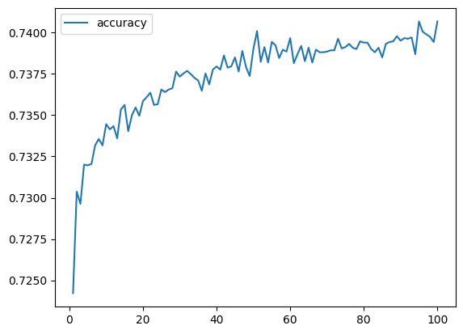
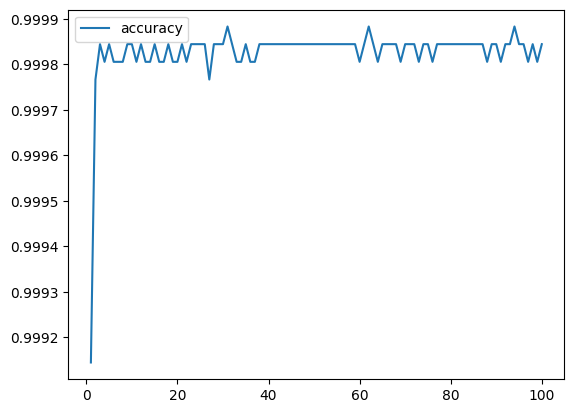

# deep-learning-challenge

## Overview of the Analysis

The purpose of this neural network is to determine which applicants have the best chance of success is given funding.  The data provided contained details from over 77,000 past applications to the organization Alphabet Soup.  For each loan, information was given on different factors, including:
- EIN
- Name
- Application Type
- Affiliation
- Classification
- Use Case
- Organization Type
- Status (Active or Not)
- Income classification amount
- Special Considerations
- Asking amount

Each application was then marked as whether it was successful or not.  This data set was to be analyzed and used to predict whether future applications, when given those same statistics, would be likely to be successful in their venture.  A neural network was created and optimized to create the most accurate model with the least amount of loss. 

## Results

# Initial Model
The initial model, created by the file MainAlphabetSoup.ipynb, was created by optizing the data in a number of ways:
- Unneccesary data was removed (Name and EID)
- Outliers were grouped together in both Application Type and Classification under the name "Other"
- All other columns were encoded to allow reading by the neural network
- Data was scaled using StandardScaler

A Keras model was used to create the neural network.  2 layers were used, with 80 and 30 bins. There were 43 features in this model. 
After training, the model was scored:
Loss: 0.5615041255950928, Accuracy: 0.7297959327697754

* Data Preprocessing
The target variable used was "Is Successful"

Features for the model were:
- Application Type
- Affiliation
- Classification
- Use Case
- Organization Type
- Status (Active or Not)
- Income classification amount
- Special Considerations
- Asking amount

Removed from the model, at this time, were the name and EID. These were neither targets nor features. 

* Compiling, Training, and Evaluating the Model
I used two hidden layers in my model, with 80 and 30 units.  Both used were "relu" activation.  The output layer had a single unit and used a sigmoid activation. 

* Results 
Using the intial model, I was not able to achieve acceptible results.  The model was only 72.9% accurate. 

# Further Models
Using the file AlphabetSoupOptimization.ipynb, three further instances of the Keras neural network were created, trained, and tested.  
These models were:

1. Removing the Use_Case column
Results: 
Loss: 0.5645918846130371, Accuracy: 0.7289795875549316

2. Removing Ask_Amt column
Results:
Loss: 0.0035282291937619448, Accuracy: 0.9998833537101746

3. Increasing number of bins in the model to 100 in the first hidden layer:
Results:
Loss: 0.002723554614931345, Accuracy: 0.9998833537101746

* Results
My first attempt to optimize the model was to take out the data from the Use_case column.  This had almost no effect on the model.  My second attempt was to remove the Ask_Amt column.  This created a huge effect, taking the accuracy of the model up to 99.9%! Finally, I attempted to tweak the model by increasing the number of units in the first layer.  This decreased the loss of the model from 0.0035 to 0.0027. While this is a positive change, it doesn't have the substantial effect that the previous change in the model did. 

Recommended Model Results (from #2):

## Summary
The model from the attempt after removing the Ask_amt column was definitely the model that first achieved the desired results of over 75% accuracy, and is in fact a very successful model and can be used to predict which applications will be successful for Alphabet Soup. I would recommend this model be used by the company in the future. 

## Libraries 
Code is written in Python, using the following libraries: Pandas, Pathlib, SkLearn, TensorFlow, MatPlotLib

## Author
Code written by Alana Castellano, with starter code provided by Data Analytics Bootcamp and Ariel Gamino.

 